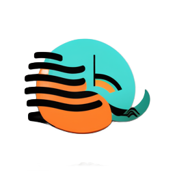

# SoundSurf
# Music Player and Equalizer Web Application

This is a web application that serves as a music player with an integrated equalizer. It allows users to play their favorite songs while customizing the audio output using the built-in equalizer. The application provides a seamless and immersive music listening experience.

## Features

- Play/pause functionality: Users can play and pause songs with a single click.
- Equalizer: The integrated equalizer allows users to adjust the audio settings according to their preferences. It provides a 5-band equalization control for precise audio tuning.
- Song visualization: The application visualizes the audio output, creating an engaging visual representation of the playing song.
- User registration and login: Users can create an account and log in to access their personalized music library and preferences.
- Theme customization: Users have the option to customize the theme of the application, allowing them to personalize their music listening experience.
- Cross-platform compatibility: The web application is designed to be compatible with various devices and operating systems, ensuring a seamless user experience.

## Technologies Used

- HTML: Markup language for structuring the web pages.
- CSS: Stylesheet language for styling the web pages.
- JavaScript: Programming language for implementing interactive functionality.
- Wavesurfer Framework: JavaScript library for audio visualization and playback control.
- MockAPI: Mock API service for storing user data and songs.
- roundSLider: jQuery plugin that allows the user to select a value or range of values.

## Installation

To run the application locally, follow these steps:

1. Clone the repository: `git clone https://github.com/OGADAMo/SoundSurf`
2. Open the project directory in your preferred code editor.
3. Launch the application by opening the `index.html` file in a web browser.

## Usage

1. Open the application in your web browser.
2. Register or log in to your account.
3. Upload your favorite songs to the application or choose from the existing library.
4. Use the play/pause button to control the playback of the selected song.
5. Adjust the equalizer bands to fine-tune the audio output according to your preferences.
6. Explore other features of the application, such as theme customization and song visualization.

## Contributing

Contributions to this project are welcome. If you find any bugs or have suggestions for improvement, please submit an issue or a pull request.

## License

This project is licensed under the [MIT License](link_to_license_file). You are free to modify, distribute, and use the code in this project for personal or commercial purposes.

## Contact

For any inquiries or feedback, please contact [adam.marjanovic2@gmail.com].

Enjoy the music!
